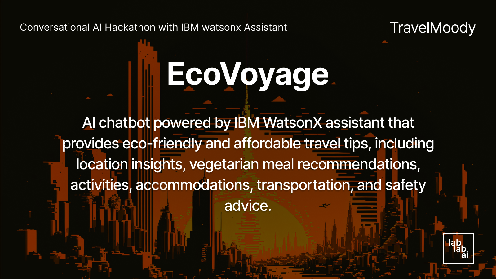
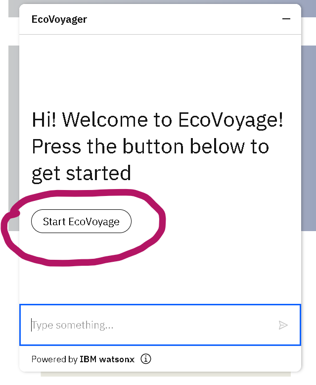
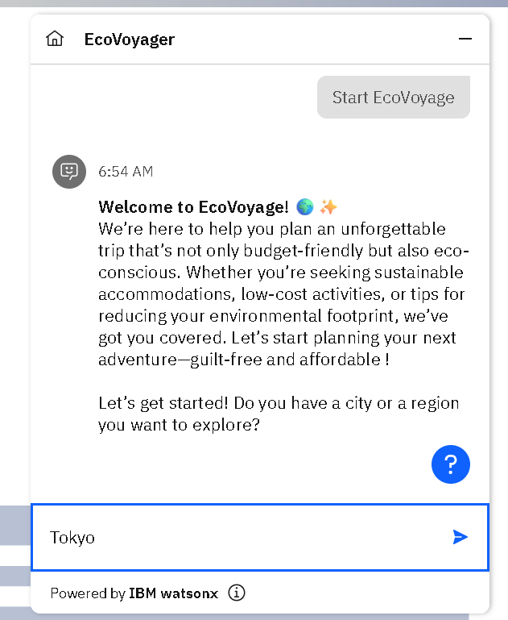
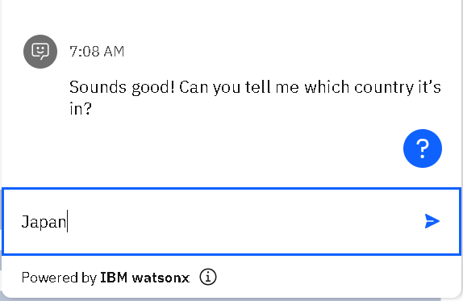
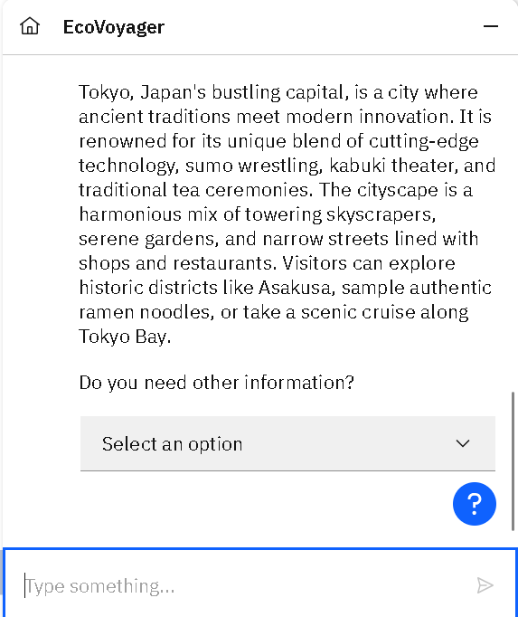
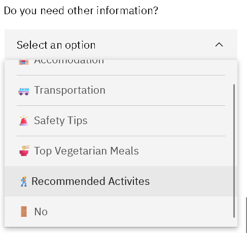
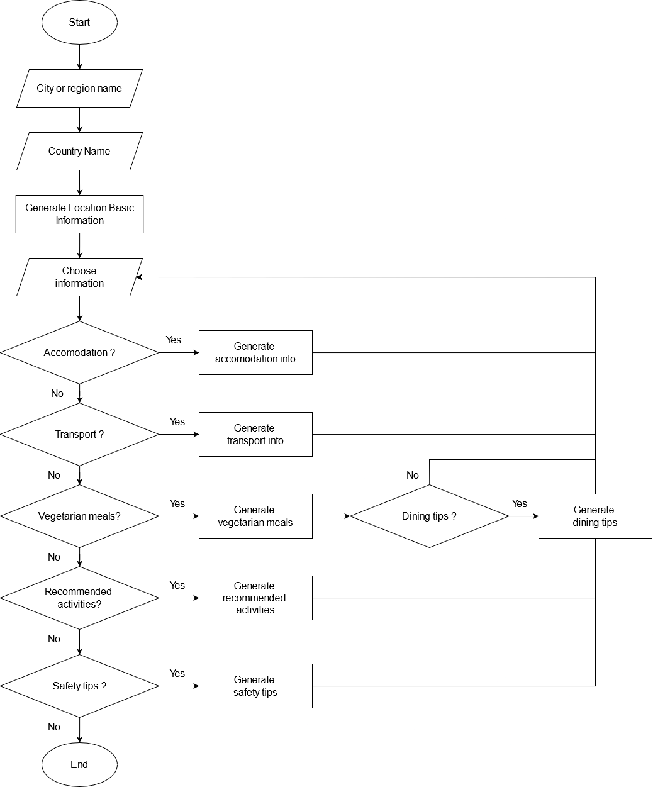

# ✈️ EcoVoyage

EcoVoyage is a cutting-edge AI-powered travel assistant developed using IBM Watson X, designed to make your travel planning not just easy but also eco-friendly and affordable. Whether you're setting out to explore new destinations or planning your next getaway, EcoVoyage has you covered with a range of smart features to enhance every aspect of your journey.

## 🔗 Link demo 

https://bit.ly/eco_voyage_demo

## 💡 Features  

- Essential details about your destination, including cultural significance and key information.  
- Discover recommended vegetarian meals and budget-conscious dining options.  
- Curated activities that immerse you in local culture while minimizing environmental impact.  
- Affordable accomodations options that prioritize sustainability.  
- Recommendations for cost-effective and eco-conscious transportation.  
- Practical tips tailored to your destination to ensure a secure journey.

## 🧑‍💻 Technical Stack 

- IBM Watsonx Assistant
- LLM (ibm/granite-13b-chat-v2)
- IBM Cloud

## 🔨 How to start : 

1. Access the demo by accessing this link https://bit.ly/eco_voyage_demo

2. Click the blue chat button on the right bottom corner of website

3. Click the button of "Start EcoVoyage" to start 

4. Input the city that you're planning to visit

5. Input the country of your location 

6. The chatbot retrieves the basic information of your location, and if you need other information you can just select on "Select an option"

7. You can select the information of accommodations and recommended activities, and if you want to end the conversation just select "No"

## ⚙️Flow Chart

### How it works : 

1. The user starts by interacting with the EcoVoyage chatbot, sharing basic details about their trip—such as their destination (city or region) and country.
2. Based on the user’s destination, the chatbot provides essential information about the location, such as cultural highlights, language and popular tourist attraction.
3. The chatbot asked user to choose information option for user, including accomodation, transportation, safety tips, recommended activity, recommended vegetarian meals and dining tips. There's also "No" option to close conversation. 
3. If the user choose : 
	- Recommended vegetarian meals :
		- The chatbot suggests eco-friendly and vegetarian meal options available
		- The chatbot also suggests dining tips to enhance travelling experience (if user, say yes)
	- Recommended Activities : 
		- The chatbot curates a list of recommended places to visit with affordable price and also eco activities including nature experience and eco tours
	- Transportation : 
		- The chatbot helps users find eco-friendly and affordable transportation options, including public transportation, bike sharing, walk and tips from local to save money
	- Accomodation : 
		- The chatbot helps users find eco-friendly and affordable accommodations and transportation options, recommending green hotels, hostels and booking tips 
	- Safety Tips:
		- Lastly, the chatbot provides tailored safety tips specific to the user’s destination, ensuring they have useful information to stay safe and secure during their trip.
	- No : 
		- The chatbot will end the conversation

